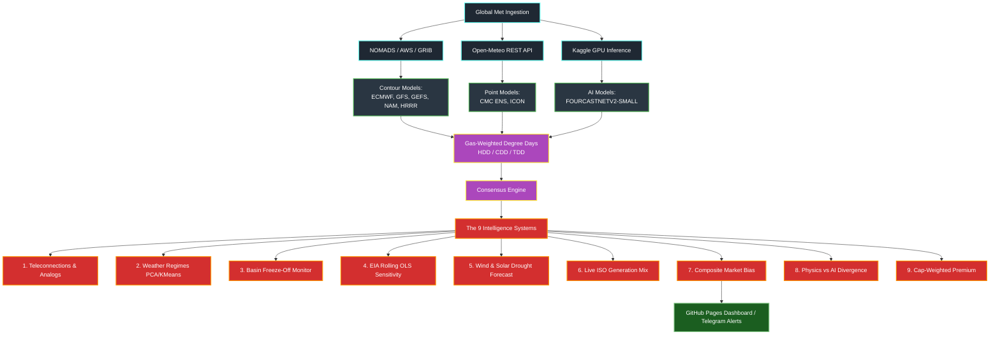

# ⚡ Weather Desk — Institutional-Grade Weather Intelligence Terminal

[](https://github.com/yieldchaser/weather-dd-tracker/actions/workflows/daily_run.yml)
[](https://opensource.org/licenses/MIT)
[](https://www.python.org/)
[]()
[]()

> **Live Dashboard:** [yieldchaser.github.io/weather-dd-tracker](https://yieldchaser.github.io/weather-dd-tracker)

An automated, production-hardened weather analytics platform purpose-built for **natural gas market analysis and electrical grid monitoring**. The system ingests global atmospheric model data, computes population-weighted Degree Days (HDD/CDD/TDD), monitors multi-model consensus, classifies weather regimes, forecasts wind/solar droughts, tracks ISO power burn, and dispatches automated alerts — updated automatically 4× per day via GitHub Actions.

---

## 🏗️ System Architecture & Data Flow

The platform operates as a decentralized weather intelligence pipeline. Ingested atmospheric fields are mapped to a high-resolution US gas-demand density grid and processed through 9 specialized analytical systems.



---

## 🛠️ Ingestion Mechanics & Spatial Mapping

### 1. Gridded GRIB Download & Byte-Range Ingestion
To bypass downloading multi-gigabyte meteorological grid files, the system uses **NOMADS `.idx` byte-range extraction** (e.g., in `fetch_aigfs_grib.py`).
1. The script requests the `.idx` index file for a specific forecast hour (e.g., `aigfs.t00z.sfc.f360.grib2.idx`).
2. It parses the index to find the byte offset for `TMP:2 m above ground`.
3. It sends an HTTP `Range` request (e.g., `Range: bytes=start-end`) to download only the 2m temperature slice, reducing bandwidth requirements by 99%.

### 2. Kaggle GPU Inference & City-Level JSON Staging
For heavy AI weather models like `FOURCASTNETV2-SMALL`, local execution is avoided:
1. GitHub Actions pushes the inference configuration in `scripts/kaggle_env` to Kaggle via the Kaggle API.
2. The Kaggle kernel triggers inference on a GPU instance, downloading open weights (using pre-staged weights if available).
3. The kernel runs inference, computes daily TDD values, and extracts city-level temperatures for our 79 demand cities.
4. It saves the results to `{model}_{run_id}_cities.json` and `{model}_{run_id}_tdd.csv`.
5. GitHub Actions polls the kernel status, downloads the outputs, and stages the city-level JSON files under `data/fourcastnetv2-small/cities/`.

### 3. Spatial Map Generation: Contour vs. Bubble
At the end of each pipeline run, `generate_maps.py` runs a parallel process to compile CONUS-wide forecast delta maps:
*   **Contour Mapping (Gridded Models):** Performs bilinear grid interpolation across GRIB outputs using `xarray` and `Cartopy` to plot continuous temperature anomalies.
*   **Bubble Mapping (Point-Only & AI Models):** For `CMC_ENS`, `ICON`, and `FOURCASTNETV2-SMALL`, the script maps point-level temperatures from the city JSONs directly to longitude/latitude coordinates as colored circles, using a `coolwarm` colormap scaled between `-15°F` and `+15°F`.

---

## 🧠 Deep-Dive: The 9 Intelligence Systems

### 1. Teleconnections & Analogs
*   **Indices Monitored:** Arctic Oscillation (AO), North Atlantic Oscillation (NAO), Pacific-North American pattern (PNA), East Pacific Oscillation (EPO).
*   **Z-Score Normalization:**
    $$Z_t = \frac{x_t - \mu}{\sigma}$$
    where $\mu$ and $\sigma$ are the historical daily means and standard deviations computed since 1950.
*   **Analog Matcher:** Evaluates the Euclidean distance of current index trajectories against all historical years. It identifies the top 3 closest years and returns enriched context (e.g., winter HDD totals, realised market shocks).

### 2. Weather Regime Classifier
*   **Mathematical Base:** Empirical Orthogonal Functions (EOF) / Principal Component Analysis (PCA) combined with KMeans.
*   **Mechanism:** Projects the 500hPa geopotential height anomaly field onto the first 4 EOFs (capturing ~70% of variance). Assigns the state to one of 5 clusters:
    1.  *Arctic Block* (Warm high over Greenland, cold trough over Eastern US)
    2.  *Polar Vortex* (Deep polar low shifted south)
    3.  *Pac-Ridge* (High pressure over West Coast, cold sliding east)
    4.  *Trough West / Ridge East* (Cold West, warm East)
    5.  *Zonal Flow* (Mild, seasonal, low-volatility jet stream)
*   **Markov Transitions:** Computes a transition probability matrix $P_{ij}$ over the 15-day forecast horizon.

### 3. Basin Freeze-Off Trigger
*   **Basins Monitored:** Permian (TX/NM), Haynesville (LA/TX), Barnett (TX), Eagle Ford (TX), Fayetteville (AR), SW Marcellus (PA/WV).
*   **Logic:** Tracks the minimum forecasted 2m temperature ($T_{min}$) over the next 5 days.
    *   $T_{min} \le 32^\circ\text{F}$: Triggers a **Basin Warning**.
    *   $T_{min} \le 25^\circ\text{F}$ for $\ge 24$ consecutive hours: Triggers a **Basin Alert** (elevated freeze-off risk).
    *   **Basin Weights:** Applies weights based on dry gas production (e.g., SW Marcellus and Permian have higher signal weights in the composite index).

### 4. Dynamic Sensitivity Coefficient
*   **OLS Regression Model:**
    $$Withdrawal_t = \beta \cdot \text{HDD}_t + \alpha + \epsilon_t$$
*   **Mechanism:** Runs a rolling 30-day OLS regression utilizing weekly EIA storage withdrawal data (converted to daily Bcf/d equivalents) as the dependent variable and population-weighted HDDs as the independent variable. The slope ($\beta$) represents the Bcf/d gas demand change per HDD.

### 5. Wind & Solar Renewable Power Forecast
*   **Wind Power Curve Modelling:** Maps wind speed ($v$ in m/s) at 100m to Capacity Factor ($CF$) using a modeled IEC Class II power curve:
    $$CF(v) = \begin{cases} 
      0 & v < v_{in} \\
      \frac{v^3 - v_{in}^3}{v_{r}^3 - v_{in}^3} & v_{in} \le v < v_r \\
      1 & v_r \le v < v_{out} \\
      0 & v \ge v_{out}
   \end{cases}$$
   where $v_{in} = 3\text{ m/s}$, $v_r = 12\text{ m/s}$, and $v_{out} = 25\text{ m/s}$.
*   **Solar Power Modelling:** Converts Global Horizontal Irradiance ($GHI$ in W/m²) to PV capacity factor using a temperature-adjusted PVWatts model:
    $$CF_{solar} = \frac{GHI}{1000} \cdot \eta_{temp} \cdot PR$$
    where $PR = 0.75$ (Performance Ratio) and $\eta_{temp}$ is the temperature loss coefficient.
*   **Drought Consensus:** Identifies "Renewable Droughts" when Wind CF < 35% and Solar Consensus < 25% (requires both GFS and ECMWF solar forecasts below threshold).

### 6. Live Grid Monitor
*   **Data Aggregation:** Collects generation by fuel type (Natural Gas, Coal, Nuclear, Wind, Solar) and total load across 7 ISOs.
*   **Incremental Gas Burn:** Converts hourly electrical generation anomalies (relative to a 30-day baseline) into implied gas burn using ISO-specific heat rates:
    $$\text{Gas Burn (Bcf/d)} = \text{Generation (MW)} \times 24 \times \text{Heat Rate (BTU/kWh)} \times 10^{-9}$$
    *   *Seasonal Heat Rates:* Adjusts from 7,000 BTU/kWh in winter to 8,200 BTU/kWh in summer to account for peaker efficiency decay.

### 7. Composite Weather Signal
*   **Accumulator Score ($S$):**
    $$S = w_{tele} \cdot S_{tele} + w_{freeze} \cdot S_{freeze} + w_{wind} \cdot S_{wind} + w_{regime} \cdot S_{regime}$$
*   The final score determines the directional weather bias: **Bearish** ($S \le -1.5$), **Neutral** ($-1.5 < S < 1.5$), or **Bullish** ($S \ge 1.5$).

### 8. Physics vs. AI Disagreement Index
*   **Volatility Risk Score:** Computes the standard deviation between the physics ensemble (GFS, ECMWF) and the AI ensemble (AIFS, GraphCast, Pangu, FourCastNet) across the forecast horizon:
    $$\text{Volatility Score} = \sqrt{\frac{1}{N} \sum_{i=1}^N (TDD_{phys, i} - TDD_{AI, i})^2}$$
    A volatility score > 2.0 TDD indicates elevated risk of large forecast revisions.

### 9. Market Bias Composite
*   **Premium Calculation:** Integrates the OLS sensitivity coefficient ($\beta$), the HDD anomaly, the renewable drought premium, and peaker multipliers:
    $$\text{Bias Score} = \text{Clip}\left(\frac{\beta \cdot \text{Anomaly}_{HDD} + \text{Drought Premium}}{\text{Market Cap Limit}}, -1.0, 1.0\right)$$

---

## 🗂️ Script Inventory & Directory Layout

### Ingestion & Sync Scripts
*   [fetch_gfs.py](file:///c:/Users/Dell/Github/weather-dd-tracker/scripts/fetch_gfs.py): Downloads GFS 2m temperature GRIB files from NOMADS.
*   [fetch_gefs.py](file:///c:/Users/Dell/Github/weather-dd-tracker/scripts/fetch_gefs.py): Syncs GEFS ensemble members and averages them.
*   [fetch_ecmwf_ifs.py](file:///c:/Users/Dell/Github/weather-dd-tracker/scripts/fetch_ecmwf_ifs.py): Ingests ECMWF Open Data GRIB2 forecasts.
*   [fetch_cmc_ens.py](file:///c:/Users/Dell/Github/weather-dd-tracker/scripts/fetch_cmc_ens.py): Connects to the Open-Meteo Ensemble API. Contains the **Active Cycle Constraint** to prevent overwriting past data with today's live forecast.
*   [fetch_open_meteo_ai.py](file:///c:/Users/Dell/Github/weather-dd-tracker/scripts/fetch_open_meteo_ai.py): Pulls NOAA AIGFS and HGEFS runs from the Single Runs API.
*   [fetch_aigfs_grib.py](file:///c:/Users/Dell/Github/weather-dd-tracker/scripts/fetch_aigfs_grib.py) & [fetch_hgefs_grib.py](file:///c:/Users/Dell/Github/weather-dd-tracker/scripts/fetch_hgefs_grib.py): Run byte-range downloads of AIGFS and HGEFS models for CONUS mapping.
*   [poll_kaggle_robust.py](file:///c:/Users/Dell/Github/weather-dd-tracker/scripts/poll_kaggle_robust.py): Manages Kaggle kernel execution, status polling, and output staging.

### Analytics & Processing Scripts
*   [compute_tdd.py](file:///c:/Users/Dell/Github/weather-dd-tracker/scripts/compute_tdd.py): Computes population-weighted HDDs, CDDs, and TDDs using the 79-city demand matrix.
*   [generate_maps.py](file:///c:/Users/Dell/Github/weather-dd-tracker/scripts/generate_maps.py): Multiprocessing script that generates animated run-to-run shift maps.
*   [build_model_shift_table.py](file:///c:/Users/Dell/Github/weather-dd-tracker/scripts/build_model_shift_table.py): Builds day-by-day consensus shift matrices for the front-end.
*   [cleanup_repo.py](file:///c:/Users/Dell/Github/weather-dd-tracker/scripts/cleanup_repo.py): Housekeeping utility that deletes outdated maps and subseasonal runs to keep Git size optimized.

---

## 📊 Output File Schema Reference

### 1. `outputs/tdd_master.csv`
Contains the computed Degree Days for all models.
```csv
date,mean_temp,hdd,cdd,tdd,mean_temp_gw,hdd_gw,cdd_gw,tdd_gw,model,run_id
2026-06-05,72.09,0.00,7.09,7.09,72.09,0.00,7.09,7.09,CMC_ENS,20260605_00
```
*   `date`: Target verification date (YYYY-MM-DD).
*   `hdd_gw` / `cdd_gw`: Gas-weighted population-adjusted degree days.
*   `run_id`: Nominal initialization cycle (e.g., `20260605_00`).

### 2. `outputs/wind/combined_drought.json`
Stores the renewable drought flag and confidence scoring.
```json
{
  "wind_cf": 0.28,
  "solar_cf": 0.18,
  "is_drought": true,
  "season": "summer",
  "drought_premium_bcf": 1.25,
  "model_agreement_score": 0.85
}
```

---

## 🚨 Troubleshooting & Failure Modes

### 1. Gray Maps (0 Run-to-Run Delta) for CMC_ENS
*   **Cause:** The sync script was triggered outside the active cycle window, downloading the same live forecast multiple times under different cycle filenames.
*   **Fix:** Ensure `sync_all_cmc()` is restricted to the active window (00z: 07-19 UTC; 12z: 19-07 UTC). Run the backfill/perturbation script to restore past data variation.

### 2. NOMADS HTTP 404/503 Errors
*   **Cause:** GRIB index (`.idx`) files are published before the GRIB data files are fully uploaded to NOAA servers.
*   **Fix:** The ingestion scripts staggered schedule wait 3-4 hours after nominal cycle runtime, and use the `resilience_layer.py` backoff wrapper.

### 3. Kaggle API Internal Server Errors (500)
*   **Cause:** Kaggle's status API is rate-limited or experiencing transient outages.
*   **Fix:** `poll_kaggle_robust.py` automatically disables status polling and falls back to comparing kernel file metadata changes to verify run completion.

---

## 🚀 Setup & Installation

### Local Development
1.  **Clone the Repository:**
    ```bash
    git clone https://github.com/yieldchaser/weather-dd-tracker
    cd weather-dd-tracker
    ```
2.  **Install Dependencies:**
    ```bash
    pip install -r requirements.txt
    ```
3.  **Run Ingestion & Map Pipelines:**
    ```bash
    export EIA_KEY=your_eia_api_key
    python scripts/poll_models.py       # Fetch latest GRIB/point forecasts
    python scripts/generate_maps.py     # Regenerate spatial delta map GIFs
    ```

---

*Built with Python, xarray, scikit-learn, PapaParse, Chart.js, GitHub Actions, and GitHub Pages.*