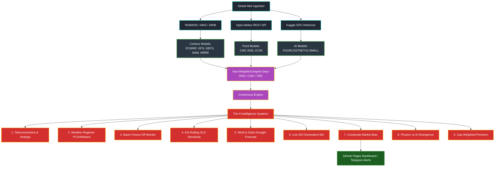

# ⚡ Weather Desk — Institutional-Grade Weather Intelligence Terminal

[](https://github.com/yieldchaser/weather-dd-tracker/actions/workflows/daily_run.yml)
[](https://opensource.org/licenses/MIT)
[](https://www.python.org/)
[]()
[]()

> **Live Dashboard:** [yieldchaser.github.io/weather-dd-tracker](https://yieldchaser.github.io/weather-dd-tracker)

An automated, production-hardened weather analytics platform purpose-built for **natural gas market analysis and electrical grid monitoring**. The system ingests global atmospheric model data, computes population-weighted Degree Days (HDD/CDD/TDD), monitors multi-model consensus, classifies weather regimes, forecasts wind/solar droughts, tracks ISO power burn, and dispatches automated alerts — refreshed up to 6× per day via publication-aligned GitHub Actions polling (slots sit ~1h after each model cycle completes, so fresh runs display within ~1–2.5h of publication).

---

## 🏗️ System Architecture & Data Flow

The platform operates as a decentralized weather intelligence pipeline. Ingested atmospheric fields are mapped to a high-resolution US gas-demand density grid and processed through 9 specialized analytical systems.


```mermaid
graph TD
    classDef Ingest fill:#1f2833,stroke:#66fcf1,stroke-width:2px,color:#fff;
    classDef Model fill:#2a3642,stroke:#4caf50,stroke-width:2px,color:#fff;
    classDef Calc fill:#ab47bc,stroke:#ffeb3b,stroke-width:2px,color:#fff;
    classDef Intel fill:#d32f2f,stroke:#ff9800,stroke-width:2px,color:#fff;
    classDef Out fill:#1b5e20,stroke:#81c784,stroke-width:2px,color:#fff;

    A[Global Met Ingestion] --> B[NOMADS / AWS / GRIB]
    A --> C[Open-Meteo REST API]
    A --> D[Kaggle GPU Inference]
    
    B --> E[Contour Models:<br/>ECMWF, GFS, GEFS, NAM, HRRR]
    C --> F[Point Models:<br/>CMC ENS, ICON]
    D --> G[AI Models:<br/>FOURCASTNETV2-SMALL]
    
    E --> H[Gas-Weighted Degree Days<br/>HDD / CDD / TDD]
    F --> H
    G --> H
    
    H --> I[Consensus Engine]
    
    I --> J[The 9 Intelligence Systems]
    J --> J1[1. Teleconnections & Analogs]
    J --> J2[2. Weather Regimes PCA/KMeans]
    J --> J3[3. Basin Freeze-Off Monitor]
    J --> J4[4. EIA Rolling OLS Sensitivity]
    J --> J5[5. Wind & Solar Drought Forecast]
    J --> J6[6. Live ISO Generation Mix]
    J --> J7[7. Composite Market Bias]
    J --> J8[8. Physics vs AI Divergence]
    J --> J9[9. Cap-Weighted Premium]
    
    J7 --> K[GitHub Pages Dashboard / Telegram Alerts]

    class A,B,C,D Ingest;
    class E,F,G Model;
    class H,I Calc;
    class J,J1,J2,J3,J4,J5,J6,J7,J8,J9 Intel;
    class K Out;
```

---

## 🛠️ Ingestion Mechanics & Spatial Mapping

### 1. Gridded GRIB Download & Byte-Range Ingestion
To bypass downloading multi-gigabyte meteorological grid files, the system uses **NOMADS `.idx` byte-range extraction** (e.g., in `fetch_aigfs_grib.py`).
1. The script requests the `.idx` index file for a specific forecast hour (e.g., `aigfs.t00z.sfc.f360.grib2.idx`).
2. It parses the index to find the byte offset for `TMP:2 m above ground`.
3. It sends an HTTP `Range` request (e.g., `Range: bytes=start-end`) to download only the 2m temperature slice, reducing bandwidth requirements by 99%.

### 2. Kaggle GPU Inference & City-Level JSON Staging
For heavy AI weather models like `FOURCASTNETV2-SMALL`, local execution is avoided:
1. GitHub Actions pushes the inference configuration in `scripts/kaggle_env` to Kaggle via the Kaggle API.
2. The Kaggle kernel triggers inference on a GPU instance, downloading open weights (using pre-staged weights if available).
3. The kernel runs inference, computes daily TDD values, and extracts city-level temperatures for our 79 demand cities.
4. It saves the results to `{model}_{run_id}_cities.json` and `{model}_{run_id}_tdd.csv`.
5. GitHub Actions polls the kernel status, downloads the outputs, and stages the city-level JSON files under `data/fourcastnetv2-small/cities/`.

### 3. Spatial Map Generation: Contour vs. Bubble
At the end of each pipeline run, `generate_maps.py` runs a parallel process to compile CONUS-wide forecast delta maps:
*   **Contour Mapping (Gridded Models):** Performs bilinear grid interpolation across GRIB outputs using `xarray` and `Cartopy` to plot continuous temperature anomalies.
*   **Bubble Mapping (Point-Only & AI Models):** For `CMC_ENS`, `ICON`, `GOOGLE_WN2`, `GOOGLE_WN3`, and `FOURCASTNETV2-SMALL`, the script maps point-level temperatures from the city JSONs directly to longitude/latitude coordinates as colored circles, using a `coolwarm` colormap scaled between `-15°F` and `+15°F`.

### 4. Cloud Object-Store Zarr Ingestion (Google DeepMind WeatherNext 3)
WeatherNext 3 (`GOOGLE_WN3`) provides 0.05° (~5 km) surface resolution with 64-member precomputed ensemble statistics (`temperature_2m_mean`, `temperature_2m_p10`, `temperature_2m_p90`) on Google Cloud Storage (`gs://weathernext3_statistics_spatial/`):
1. `scripts/fetch_wn3.py` connects lazily via `obstore` / `zarr` / `xarray`.
2. Rather than downloading multi-gigabyte global grids, it performs **lazy nearest-neighbor spatial indexing (`.sel(method='nearest')`)** specifically across the 79 demand cities before computing, maintaining memory usage under 10 MB.
3. Outputs daily gas-weighted HDD/CDD/TDD metrics and city-level temperatures for run-to-run shift maps.
4. WeatherNext 3 data is provided by Google DeepMind / Google Research (CC BY 4.0 after 1 hour).

---

## 🧠 Deep-Dive: The 9 Intelligence Systems

### 1. Teleconnections & Analogs
*   **Indices Monitored:** Arctic Oscillation (AO), North Atlantic Oscillation (NAO), Pacific-North American pattern (PNA), East Pacific Oscillation (EPO).
*   **Z-Score Normalization:**
    $$Z_t = \frac{x_t - \mu}{\sigma}$$
    where $\mu$ and $\sigma$ are the historical daily means and standard deviations computed since 1950. EPO is read from the live 20CR core-reanalysis file (the legacy R1 file stopped updating in Mar 2026); any feed older than 10 days is excluded from the current state and emitted as `null` rather than masquerading as neutral.
*   **Analog Matcher:** Computes the Euclidean distance of today's z-scored index vector against every historical winter day in σ-space on both sides, averages by year, and returns the top-3 closest winters. Their March/April outcomes are **real**: gas-weighted HDD anomalies vs the 1991–2020 normals, computed from the same ERA5 archive that builds the normals (cached per year in `data/analog_outcomes.csv`, heating-season fetching only). Years without archive coverage ship without outcome numbers instead of invented ones.

### 2. Weather Regime Classifier
*   **Mathematical Base:** Empirical Orthogonal Functions (EOF) / Principal Component Analysis (PCA) combined with KMeans.
*   **Mechanism:** Projects the 500hPa geopotential height anomaly field onto the first 4 EOFs (capturing ~70% of variance). Assigns the state to one of 5 clusters:
    1.  *Arctic Block* (Warm high over Greenland, cold trough over Eastern US)
    2.  *Polar Vortex* (Deep polar low shifted south)
    3.  *Pac-Ridge* (High pressure over West Coast, cold sliding east)
    4.  *Trough West / Ridge East* (Cold West, warm East)
    5.  *Zonal Flow* (Mild, seasonal, low-volatility jet stream)
*   **Markov Transitions:** Computes a transition probability matrix $P_{ij}$ over the 15-day forecast horizon.

### 3. Basin Freeze-Off Trigger
*   **Basins Monitored:** Permian (TX/NM), Haynesville (LA/TX), Barnett (TX), Eagle Ford (TX), Fayetteville (AR), SW Marcellus (PA/WV).
*   **Logic:** Tracks the minimum forecasted 2m temperature ($T_{min}$) over the next 5 days.
    *   $T_{min} \le 32^\circ\text{F}$: Triggers a **Basin Warning**.
    *   $T_{min} \le 25^\circ\text{F}$ for $\ge 24$ consecutive hours: Triggers a **Basin Alert** (elevated freeze-off risk).
    *   **Basin Weights:** Applies weights based on dry gas production (e.g., SW Marcellus and Permian have higher signal weights in the composite index).

### 4. Dynamic Sensitivity Coefficient
*   **OLS Regression Model:**
    $$\text{PowerBurn}_t = \beta \cdot \text{DD}_t + \alpha + \epsilon_t$$
*   **Mechanism:** Runs a fixed 90-day OLS regression of **realized national power burn** (from `gas_burn_history.csv`, rows gated to ≥18h-complete sample days) on the burn file's own realized degree days. The slope ($\beta$) is Bcf/day per degree day; 30-day windows are too short for a stable fit (live Aug-2026 check: R²=0.04 at 30d vs 0.31 at 90d).
*   **Season-Banded Percentiles:** Because fleet heating sensitivity (Bcf/HDD) and cooling sensitivity (Bcf/CDD) differ physically, reference ranges are banded by season (winter HDD ~1.5–3.0, summer CDD ~0.6–1.5 Bcf/deg). The Weather Intelligence Signal consumes the *percentile* of today's coefficient within its seasonal band rather than raw winter-calibrated coefficients — so "Low/High Weather Sensitivity" verdicts are measurement-backed in both seasons.

### 5. Wind & Solar Renewable Power Forecast
*   **Wind Power Curve Modelling:** Maps wind speed ($v$ in m/s) at 100m to Capacity Factor ($CF$) using a modeled IEC Class II power curve:
    $$CF(v) = \begin{cases} 
      0 & v < v_{in} \\
      \frac{v^3 - v_{in}^3}{v_{r}^3 - v_{in}^3} & v_{in} \le v < v_r \\
      1 & v_r \le v < v_{out} \\
      0 & v \ge v_{out}
   \end{cases}$$
   where $v_{in} = 3\text{ m/s}$, $v_r = 12\text{ m/s}$, and $v_{out} = 25\text{ m/s}$.
*   **Solar Power Modelling:** Converts Global Horizontal Irradiance ($GHI$ in W/m²) to PV capacity factor using a temperature-adjusted PVWatts model:
    $$CF_{solar} = \frac{GHI}{1000} \cdot \eta_{temp} \cdot PR$$
    where $PR = 0.75$ (Performance Ratio) and $\eta_{temp}$ is the temperature loss coefficient.
*   **Drought Consensus:** Identifies "Renewable Droughts" against season-moving thresholds (wind national CF: 35% winter / 30% shoulder / 25% summer; solar peak-hour CF: 35% summer / 25% shoulder / 15% winter), with climatology built from multi-year GFS hindcasts per calendar window. A solar drought requires consensus (2-of-active models below threshold); the combined wind+solar signal reads both thresholds from the same seasonal functions that set the flags.

### 6. Live Grid Monitor
*   **Data Aggregation:** Collects generation by fuel type (Natural Gas, Coal, Nuclear, Wind, Solar) and total load across 7 ISOs.
*   **Incremental Gas Burn:** Converts hourly electrical generation anomalies (relative to a 30-day baseline) into implied gas burn using ISO-specific heat rates:
    $$\text{Gas Burn (Bcf/d)} = \text{Generation (MW)} \times 24 \times \text{Heat Rate (BTU/kWh)} \times 10^{-9}$$
    *   *Seasonal Heat Rates:* Adjusts from 7,000 BTU/kWh in winter to 8,200 BTU/kWh in summer to account for peaker efficiency decay.
*   **Data Retention:** `hourly_grid_data.csv` accumulates as a deduplicated history (180-day window, keyed on `period`+`iso`) instead of being overwritten each run; `live_grid_generation.csv` retains a 365-day rolling window (previously 35 days). Daily histories (`gas_burn`, `thermal`, `peaker`, `outages`, `wind_actuals`) append indefinitely and are excluded from cleanup pruning.
*   **Historical Integrity:** Stored gas-burn values are converted with each row's *own* month heat rate (not the current month), so the year-over-year scatter no longer churns between seasons. Thermal and peaker histories upsert **completeness-aware** (richest sample-day wins, ties go to the newest capture), so an early partial-day capture can never permanently overwrite a complete stored day.
*   **Dashboard (grid.html):** ISO fuel-mix stacked bars (gas/coal/nuclear/solar/wind per region), national power-burn trend with degree-day overlay, peaker chart with peak/off-peak GW bars and a 1.4× heavy-dispatch threshold line, and as-of stamps on all summary cards.
*   **Burn Sensitivity Analytics** (`build_burn_sensitivity.py` → `outputs/burn_sensitivity.json`): fits a quadratic temp-response curve $\text{Bcf/d} = aT^2 + bT + c$ over the trailing 180-day burn×temperature window and derives:
    *   *Sensitivity arms:* dB/dT at the current temperature plus separate heating (Bcf/HDD) and cooling (Bcf/CDD) regressions — the empirical "Bcf per degree" numbers behind the scatter's fitted curve.
    *   *Weather-normal baseline & performance:* what the curve implies at normal seasonal temperatures (1991–2020 climatology) vs realized burn; rolling 7/28-day bias and MAE isolate non-weather drivers (load growth, outages).
    *   *Forward projection:* the next 15 days' ensemble-consensus temperature mapped through the curve onto the dashboard scatter ("Next 15d Implied") and the forecast-performance chart.
*   **ERCOT Load-Temp Fit:** daily-average ERCOT load regressed on population-weighted Texas temperature (10-metro archive fetch cached in `ercot_temp_history.csv`), reporting GW/°F slope, R², and the latest day's actual-vs-weather-implied load residual.
*   **Vintage Comparison (self-activating):** national wind and nuclear generation panels plus the peak/off-peak peaker-dispatch-ratio trend render immediately from retained history; the prior-year (LY) overlay switches on automatically once the archive spans a second calendar year — series are aligned by month-day across vintages, so fleet drift, capacity growth and efficiency decay become visible without any config change.

### 7. Composite Weather Signal
*   **Accumulator Score ($S$):**
    $$S = w_{season} \cdot (S_{tele} + S_{freeze} + S_{sensitivity} + S_{wind} + S_{regime})$$
    where $w_{season}$ is the seasonal weight (1.0 Dec–Mar tapering to 0.15 Jun–Aug) and flow-regime polarity flips with the season (a ridge *is* the heat in cooling season; a trough is cold delivery in heating season).
*   The final score determines the directional weather bias: **Strong Bull** ($S \ge 5$), **Bullish** ($S \ge 1.5$), **Bearish** ($S \le -1.5$), **Strong Bear** ($S \le -5$), else Neutral. Confidence blends system connectivity (stale systems drop out rather than count as neutral) with agreement among signed components.

### 8. Physics vs. AI Disagreement Index
*   **Volatility Risk Score:** Per forecast day, computes the absolute TDD spread between the physics-family consensus and the AI-family consensus, scaled to 0–100 (a 5 TDD spread = full score):
    $$\text{Volatility Score}_d = \min\left(\frac{|TDD_{AI,d} - TDD_{phys,d}|}{5},\ 1\right) \times 100$$
    Runs older than 4 days are excluded per family — a stale vintage diverges because weather evolved, not because models disagree. When either family has no fresh runs the score is `NaN` (unknown), never zero.

### 9. Market Bias Composite (Algorithmic Market Bias)
*   **Bias Score:** A directional score from −1.0 (max bearish) to +1.0 (max bullish), blending:
    *   *Consensus anomaly:* season-polarity-aware TDD anomaly vs normals (colder = bullish in HDD season, hotter = bullish in CDD season), discounted by ensemble volatility.
    *   *Live wind anomaly:* national wind-generation deviation from seasonal climatology, drought side weighted above surplus side (0.15 vs 0.10 per GW).
    *   *Non-weather burn strength:* the 28-day realized-vs-weather-normal power-burn bias from the burn engine, applied with a symmetric ±1 Bcf/d deadband (×0.03/Bcf) so structural load growth counts both ways.
*   Verdicts flip to **BULLISH/BEARISH** beyond ±0.10; inside that band the signal reads NEUTRAL.

---

## 🗂️ Script Inventory & Directory Layout

### Ingestion & Sync Scripts
*   [fetch_gfs.py](file:///c:/Users/Dell/Github/weather-dd-tracker/scripts/fetch_gfs.py): Downloads GFS 2m temperature GRIB files from NOMADS.
*   [fetch_gefs.py](file:///c:/Users/Dell/Github/weather-dd-tracker/scripts/fetch_gefs.py): Syncs GEFS ensemble members and averages them.
*   [fetch_ecmwf_ifs.py](file:///c:/Users/Dell/Github/weather-dd-tracker/scripts/fetch_ecmwf_ifs.py): Ingests ECMWF Open Data GRIB2 forecasts.
*   [fetch_cmc_ens.py](file:///c:/Users/Dell/Github/weather-dd-tracker/scripts/fetch_cmc_ens.py): Connects to the Open-Meteo Ensemble API. Contains the **Active Cycle Constraint** to prevent overwriting past data with today's live forecast.
*   [fetch_wn2.py](file:///c:/Users/Dell/Github/weather-dd-tracker/scripts/fetch_wn2.py): Pulls Google DeepMind WeatherNext 2 (64-member AI ensemble) ensemble mean via Open-Meteo, 00Z/12Z cycles only.
*   [fetch_aigefs.py](file:///c:/Users/Dell/Github/weather-dd-tracker/scripts/fetch_aigefs.py): Pulls NOAA's AIGEFS 31-member AI ensemble (`ncep_aigefs025`) on a 6-hourly active-cycle schedule.
*   [fetch_aifs_ens.py](file:///c:/Users/Dell/Github/weather-dd-tracker/scripts/fetch_aifs_ens.py): Pulls ECMWF AIFS ENS v2 (51-member AI ensemble) ensemble mean, 00Z/12Z cycles.
*   [fetch_ukmo_ens.py](file:///c:/Users/Dell/Github/weather-dd-tracker/scripts/fetch_ukmo_ens.py): Pulls the UK Met Office MOGREPS-G global ensemble (18 members) ensemble mean.
*   [fetch_ec46.py](file:///c:/Users/Dell/Github/weather-dd-tracker/scripts/fetch_ec46.py): Syncs the ECMWF EC46 sub-seasonal ensemble (46 days) daily from the Open-Meteo Seasonal API for the weeks 3-6 gap.
*   [fetch_open_meteo_ai.py](file:///c:/Users/Dell/Github/weather-dd-tracker/scripts/fetch_open_meteo_ai.py): Pulls NOAA AIGFS and HGEFS runs from the Single Runs API.
*   [fetch_aigfs_grib.py](file:///c:/Users/Dell/Github/weather-dd-tracker/scripts/fetch_aigfs_grib.py) & [fetch_hgefs_grib.py](file:///c:/Users/Dell/Github/weather-dd-tracker/scripts/fetch_hgefs_grib.py): Run byte-range downloads of AIGFS and HGEFS models for CONUS mapping.
*   [poll_kaggle_robust.py](file:///c:/Users/Dell/Github/weather-dd-tracker/scripts/poll_kaggle_robust.py): Manages Kaggle kernel execution, status polling, and output staging.

### Analytics & Processing Scripts
*   [compute_tdd.py](file:///c:/Users/Dell/Github/weather-dd-tracker/scripts/compute_tdd.py): Computes population-weighted HDDs, CDDs, and TDDs using the 79-city demand matrix.
*   [generate_maps.py](file:///c:/Users/Dell/Github/weather-dd-tracker/scripts/generate_maps.py): Multiprocessing script that generates animated run-to-run shift maps.
*   [build_model_shift_table.py](file:///c:/Users/Dell/Github/weather-dd-tracker/scripts/build_model_shift_table.py): Builds day-by-day consensus shift matrices for the front-end.
*   [cleanup_repo.py](file:///c:/Users/Dell/Github/weather-dd-tracker/scripts/cleanup_repo.py): Housekeeping utility that deletes outdated maps and subseasonal runs to keep Git size optimized.

---

## 📊 Output File Schema Reference

### 1. `outputs/tdd_master.csv`
Contains the computed Degree Days for all models.
```csv
date,mean_temp,hdd,cdd,tdd,mean_temp_gw,hdd_gw,cdd_gw,tdd_gw,model,run_id
2026-06-05,72.09,0.00,7.09,7.09,72.09,0.00,7.09,7.09,CMC_ENS,20260605_00
```
*   `date`: Target verification date (YYYY-MM-DD).
*   `hdd_gw` / `cdd_gw`: Gas-weighted population-adjusted degree days.
*   `run_id`: Nominal initialization cycle (e.g., `20260605_00`).

### 2. `outputs/wind/combined_drought.json`
Stores the renewable drought state and combined wind+solar signal.
```json
{
  "wind_drought_prob_16d": 0.5,
  "solar_drought_prob_10d": 1.0,
  "combined_drought_today": false,
  "combined_drought_prob_7d": 1.0,
  "combined_drought_days_7d": 7,
  "worst_combined_day": "2026-08-28",
  "worst_combined_renewable_cf_pct": 8.4,
  "gas_displacement_loss_gw": 6.1,
  "signal": "STRONG BULL",
  "solar_drought_threshold_cf_pct": 35.0,
  "timestamp": "2026-08-22T09:12:40Z"
}
```
*   `signal`: NEUTRAL / MODERATE BULL / MODERATE BEAR / STRONG BULL — a renewable drought (underperforming wind + solar vs seasonal climatology) forces gas-fired generation to backfill, which is demand-bullish.
*   `gas_displacement_loss_gw`: today's renewable shortfall vs climatology in GW — negative values mean a renewable surplus (bearish gas).

---

## 🚨 Troubleshooting & Failure Modes

### 1. Gray Maps (0 Run-to-Run Delta) for CMC_ENS
*   **Cause:** The sync script was triggered outside the active cycle window, downloading the same live forecast multiple times under different cycle filenames.
*   **Fix:** Ensure `sync_all_cmc()` is restricted to the active window (00z: 07-19 UTC; 12z: 19-07 UTC). Run the backfill/perturbation script to restore past data variation.

### 2. NOMADS HTTP 404/503 Errors
*   **Cause:** GRIB index (`.idx`) files are published before the GRIB data files are fully uploaded to NOAA servers.
*   **Fix:** The ingestion scripts staggered schedule wait 3-4 hours after nominal cycle runtime, and use the `resilience_layer.py` backoff wrapper.

### 3. Kaggle API Internal Server Errors (500)
*   **Cause:** Kaggle's status API is rate-limited or experiencing transient outages.
*   **Fix:** `poll_kaggle_robust.py` automatically disables status polling and falls back to comparing kernel file metadata changes to verify run completion.

---

## 🚀 Setup & Installation

### Local Development
1.  **Clone the Repository:**
    ```bash
    git clone https://github.com/yieldchaser/weather-dd-tracker
    cd weather-dd-tracker
    ```
2.  **Install Dependencies:**
    ```bash
    pip install -r requirements.txt
    ```
3.  **Run Ingestion & Map Pipelines:**
    ```bash
    export EIA_KEY=your_eia_api_key
    python scripts/poll_models.py       # Fetch latest GRIB/point forecasts
    python scripts/generate_maps.py     # Regenerate spatial delta map GIFs
    ```

---

*Built with Python, xarray, scikit-learn, PapaParse, Chart.js, GitHub Actions, and GitHub Pages.*